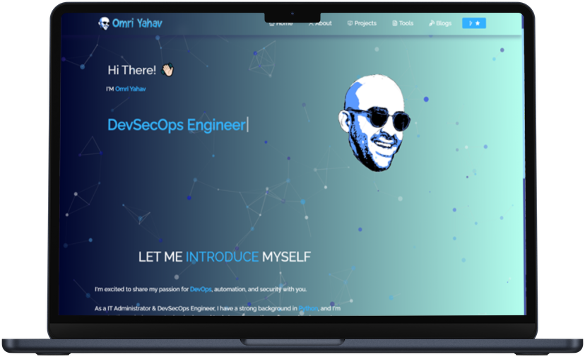

<h2 align="center">
  Portfolio Website - v3.2 
  <a href="" target="_blank">https://omriyahav.netlify.app</a>
</h2>

  

 

## Built With

My personal portfolio <a href="" target="_blank">https://omriyahav.netlify.app</a> which features some of my github projects Tools and technical skills. 

This project was built using these technologies.
- React.js
- Node.js
- Express.js
- CSS3
- VsCode

## Features

**📖 Multi-Page Layout**

**🎨 Styled with React-Bootstrap and Css with easy to customize colors**

**📱 Fully Responsive**

